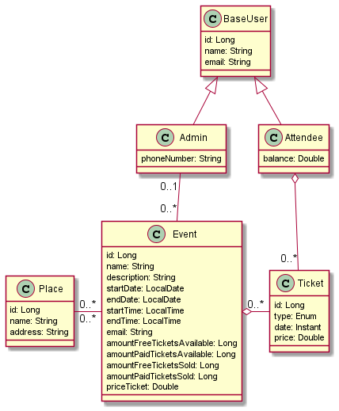

# Event Scheduler REST API

Project developed as an activity for the Object Oriented Programming 2 class of the Computer Engineering course at FACENS.

Deployed on: https://facens-poo2.herokuapp.com/

Swagger: https://facens-poo2.herokuapp.com/swagger-ui/

# Contributors

- 190715 | Carlos Eduardo do Prado Silva
- 190654 | Gabriel Maciel Silvério

# Request Bodies

## Admin

### Admin Insert Request

```json
{
  "email": "example@email.com",
  "name": "name_example",
  "phoneNumber": "99999999999"
}
```

### Admin Update Request

```json
{
  "phoneNumber": "string"
}
```

## Attendee

### Attendee Insert Request

```json
{
  "balance": 0,
  "email": "example@email.com",
  "name": "name_example"
}
```

### Attendee Update Request

```json
{
  "balance": 1000
}
```

## Event

### Event Insert Request

```json
{
  "adminId": 1,
  "amountFreeTickets": 0,
  "amountPaidTickets": 0,
  "name": "SomeName",
  "description": "",
  "place": "SomePlace",
  "startDate": "11/03/2022",
  "endDate": "15/03/2022",
  "startTime": "11:00",
  "endTime": "15:00",
  "email": "example@email.com",
  "priceTicket": 0
}
```

### Event Update Request

```json
{
  "name": "NewName",
  "description": "",
  "place": "",
  "emailContact": ""
}
```

## Place

### Place Insert Request

```json
{
  "address": "SomeAddress",
  "name": "SomeName"
}
```

### Place Update Request
```json
{
  "name": "AnotherName"
}
```

# Class Diagram


